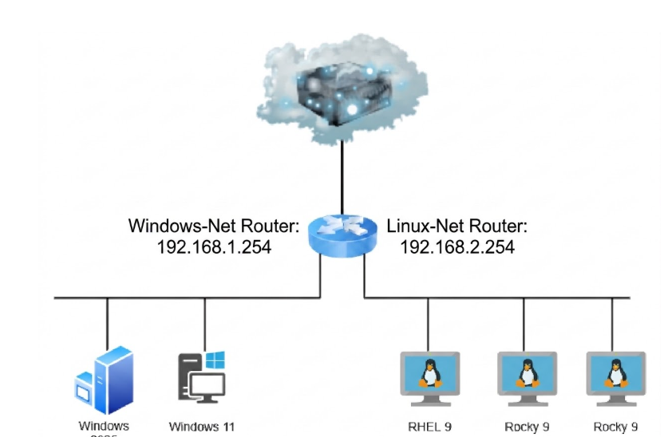

• Architecture diagram (RLES VMs, Windows AD, pfSense, trust)

• Design decisions & justifications
### Windows Network
- Windows network: `192.168.1.0/24`
- pfSense gateway: `192.168.1.254`
- Windows Server: `WIN-DC01`
- Server IP: `192.168.1.10`
- Active Directory domain: `group3.com`

### DNS
- Configured the `group3.com` forward lookup zone.
- Configured the reverse lookup zone for `192.168.1.0/24`.
- Dynamic DNS updates are set to `Secure only`.

### DHCP
- DHCP is hosted on `WIN-DC01`.
- Option 003 Router: `192.168.1.254`
- Option 006 DNS Server: `192.168.1.10`
- Option 015 DNS Domain Name: `group3.com`

### pfSense
- LAN: `192.168.1.254`
- OPT1: `192.168.2.254`
- DHCP Relay forwards requests to `192.168.1.10`.

• Validation evidence (6–8 well-captioned screenshots + output)
## Activity 0 – DNS, DHCP, and pfSense Relay

### DNS Configuration

DNS forward lookup zone for group3.com showing WIN-DC01 at 192.168.1.10 and the Windows 11 client at 192.168.1.11.

###DNS Dynamic Update

group3.com is Active Directory-integrated and configured to allow secure dynamic DNS updates.

###Reverse Lookup Zone

Reverse lookup zone configured for the Windows 192.168.1.0/24 network to support IP-to-hostname resolution.

###Windows Connectivity + DNS Test

Windows 11 successfully reached pfSense and WIN-DC01, and DNS resolved win-dc01.group3.com to 192.168.1.10

### DHCP Configuration

Windows DHCP scope options configured with pfSense (192.168.1.254) as the default gateway, WIN-DC01 (192.168.1.10) as DNS, and group3.com as the DNS suffix.

### pfSense DHCP Relay

pfSense DHCP Relay configured on the Windows (LAN) and Linux (OPT1) interfaces, forwarding DHCP requests to the Windows DHCP server at 192.168.1.10.

### Windows Client Verification

Windows 11 client successfully received its IP address, gateway, DNS server, and domain suffix from the Windows DHCP server.

• Troubleshooting journal (minimum 2–3 detailed entries)

• Links to primary official documentation

• Individual contribution note

